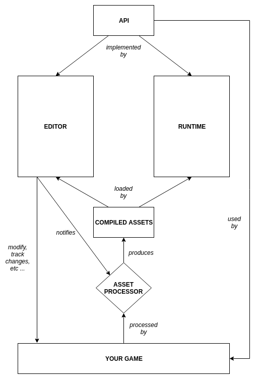

## Overview



> A high level overview of Faux's architecture.

Faux is composed of the following modules:

- An `api` which a game is built upon.
- A `runtime` which runs a game for a specific platform.
- An `editor` which allows editing certain aspect of a game.
- An `asset-processor` which converts a game's assets to a format `editor`
  and `runtime` understands.

### API
Defines a game's structure and how it interacts with the engine, a more detailed explanation can be found [here](api.md).

### Runtime
Implements `api` and responsible for running a game for a specific platform.

### Editor
A pseudo-`runtime` that also implements `api` but allows developers to edit certain aspect of a game and view the changes on the fly. 

### Asset Processor
An on-demand service that transforms raw assets to a format `runtime` and `editor` can efficiently use.

## Design decisions
The engine will be written in Kotlin targeting initially the JVM platform until Kotlin Native becomes mature. The `editor`, `runtime` and `asset-processor` are platform dependent, except for `api`.

### Reflection
Reflection allows detection of user defined classes at runtime. It will also allow instantiation of those types at runtime. One use-case is component serialization/deserialization which will be heavily used by the editor - without it means a lot of manual work when defining components. Another use-case is instantiating script classes, normally a `ScriptComponent` will only have a reference to it by name. Serializing script classes does not make sense since the important part of a script is it's logic as data is usually externalized.

Reflection is most likely going to be limited in Kotlin Native, the engine needs some clever mechanism to register important types. One way to do it is using descriptors (part of `api`) when defining a component and a script, this will allow for a rich integration in the editor (auto-completing script class for example), the problem now is registration. The only way around is having a `mainClass` which the engine will load when necessary, how the loading mechanism works will be discussed in a separate section. For the descriptors, we could use Kotlin's `companion object` since we only need one instance. 

```kotlin
class MyComponent: Component {
    ...
    
    companion object: ComponentDescriptor({
        ...
    })
}

class MyScript: Script {
    ...
    
    companion object: ScriptDescriptor({
        ...
    })
}
```

And somewhere in `mainClass`:

```kotlin
fun init() {
    engine.registerComponent(MyComponent.Companion)
    engine.registerScript(MyScript.Companion)
}
```

Manual registration is needed because there is no guarantee when a `companion object` is instantiated. Accessing `KClass<*>` does not trigger initialization so something like below won't work.

```kotlin
abstract class ComponentDescriptor(describe: (Engine) -> Unit) {
    init { describe(Engine) }
}

class MyComponent: Component {
    companion object: ComponentDescriptor({
        ...
    })
}

// sample only
inline fun <reified T> Engine.register() { doSomethingWith(T::class) }

fun init() {
    engine.register<MyComponent>()
}
``` 

It could work by creating an instance (via reflection) to trigger the init block, but we want to avoid that in the first place.

### Editor/Runtime Hook
Each platform have a different way to load the `mainClass`, for example in `native` it can be done using shared libraries while in `jvm` a `ServiceLoader` can be used. The hook will be different for each platform and will be not be public. With this in mind, the directory structure of the game will be:

```
<the-game>/
    game/ # common kotlin module
    hook/ # platform specific hooking module
```

`hook` will contain platform specific hooking logic while `game` will contain the actual code for the game.

### Lifecycle
TBD

### Editor interaction
TBD

### Project structure

### Assets format
TBD
